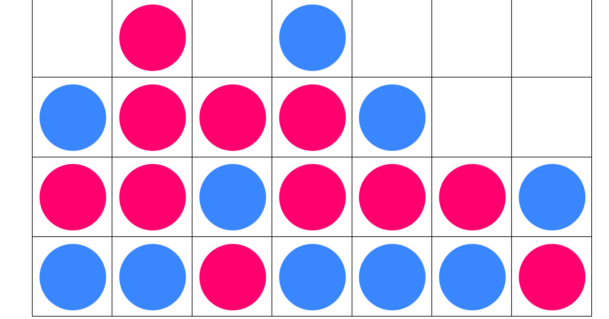

## Vier Gewinnt

Dieses Projekt wurde alleine gemacht von lichtnoa

### Anleitung
- Wählen Sie neues Spiel um ein neues Spiel zu beginnen
- Wählen Sie Laden um das abgespeicherte Spiel wieder zu laden
- Wählen Sie Speichern um das jetzige Spiel zu speichern
- Aktivieren Sie den Toggle um das Spiel auf dem Localstorage zu speichern anstatt auf dem Server
- Wählen Sie Undo um einen Zug rückgängig zu machen

### Screenshots

### Anmerkungen
- Das Speichern auf dem Server funktioniert leider nicht auf Github Pages. Die Express files wurden jedoch trotzdem hochgeladen
- Wenn man das Spiel speichern will soll man die Option: Im Localstorage speichern aktivieren.